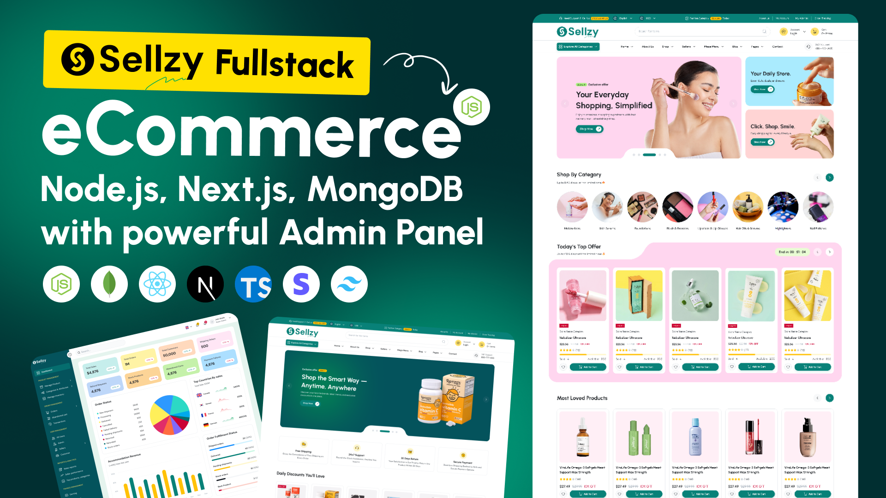

<div align="center">

# Sellzy — Multi-Vendor E-Commerce Platform



A production-ready, multi-vendor commerce stack built as a `pnpm` + Turborepo monorepo: a Next.js storefront, a Vite/React admin, and an Express + MongoDB API.

[](./sellzy-setup.md)
[](./diagram.md)
[](./Features.md)
[](./Technology.md)
[](./LICENSE)

</div>

---

## 1. What's in the box

```
sellzy-ecommerce/
├── apps/
│   ├── web/        # Next.js 16 storefront    (port 3000)
│   ├── admin/      # Vite + React dashboard   (port 5173)
│   └── api/        # Express + MongoDB API    (port 8000)
├── packages/
│   ├── ui/                 # Shared React component primitives
│   ├── eslint-config/      # Shared ESLint presets
│   └── typescript-config/  # Shared tsconfig bases
├── data/seed/      # Production-grade demo content snapshot (JSON)
├── documentation/  # Static one-page online documentation
├── _example.github/    # CI + Vercel deploy pipeline (rename → .github to activate)
├── README.md           # ← you are here
├── sellzy-setup.md     # Step-by-step buyer onboarding guide
├── diagram.md          # Architecture & data-flow diagrams
├── Features.md         # Full feature inventory
└── Technology.md       # Stack & tooling overview
```

## 2. Quick start (5 minutes)

> **Prerequisites:** Node.js ≥ 18, pnpm ≥ 10, a MongoDB Atlas connection string.
> Don't have these? See **[sellzy-setup.md → Prerequisites](./sellzy-setup.md#1-prerequisites)**.

```bash
# 1. Install
pnpm install

# 2. Configure (copy templates, then fill in values)
cp apps/api/.env.example   apps/api/.env
cp apps/web/.env.example   apps/web/.env
cp apps/admin/.env.example apps/admin/.env

# 3. Seed the demo content into your MongoDB (idempotent, never touches user data)
pnpm seed

# 4. Run all three apps in parallel
pnpm dev
```

Open the apps:

| App        | URL                            | What it is                      |
| ---------- | ------------------------------ | ------------------------------- |
| Storefront | http://localhost:3000          | Customer-facing Next.js shop    |
| Admin      | http://localhost:5173          | Master Admin & Vendor dashboard |
| API        | http://localhost:8000          | Express backend                 |
| API docs   | http://localhost:8000/api/docs | Swagger / OpenAPI explorer      |

## 3. Documentation map

| If you want to...                                    | Read                                     |
| ---------------------------------------------------- | ---------------------------------------- |
| Stand up the project from a fresh machine            | [sellzy-setup.md](./sellzy-setup.md)     |
| See how the apps talk to each other / how to deploy  | [diagram.md](./diagram.md)               |
| Get a full feature inventory for clients & marketing | [Features.md](./Features.md)             |
| Understand why each library was chosen               | [Technology.md](./Technology.md)         |
| Browse the runtime API spec                          | http://localhost:8000/api/docs (Swagger) |
| Review the LICENSE for ThemeForest distribution      | [LICENSE](./LICENSE)                     |

## 4. Common scripts

Run from the repository root.

| Command                            | What it does                                                            |
| ---------------------------------- | ----------------------------------------------------------------------- |
| `pnpm install`                     | Install all workspace dependencies                                      |
| `pnpm dev`                         | Run web + admin + api in parallel (Turbo)                               |
| `pnpm dev:web` / `:admin` / `:api` | Run a single app                                                        |
| `pnpm build`                       | Production build for every app                                          |
| `pnpm lint`                        | Lint every workspace                                                    |
| `pnpm check-types`                 | TypeScript type-check every workspace                                   |
| `pnpm seed`                        | Seed the demo content from `data/seed/*.json` into your MongoDB         |
| `pnpm export-seed`                 | Re-export non-user-flow collections from MongoDB → `data/seed/*.json`   |
| `pnpm format`                      | Prettier-format every file                                              |
| `pnpm clean`                       | Remove all `node_modules/.cache`, `.turbo`, `.next`, and `dist` folders |

The seed scripts deliberately **skip user-flow collections** (`users`, `orders`, `carts`, `addresses`, `reviews`, `notifications`, `vendors`, `abandonedcarts`, `customerreviews`). They're upsert-only — running them never deletes existing rows. See [sellzy-setup.md → Seeding](./sellzy-setup.md#5-seed-demo-content) for the full contract.

## 5. Key integrations

| Service       | Used for                               | Where to configure                                           |
| ------------- | -------------------------------------- | ------------------------------------------------------------ |
| MongoDB Atlas | Primary data store                     | `apps/api/.env` → `MONGO_URI`                                |
| Stripe        | Card checkout + webhook                | `apps/api/.env` → `STRIPE_SECRET_KEY`, webhook secret        |
| SSLCommerz    | Bangladesh payment gateway (optional)  | `apps/api/.env` → `SSLCOMMERZ_*`                             |
| ImageKit      | Default media storage / transformation | `apps/api/.env` → `IMAGEKIT_*`                               |
| Cloudinary    | Optional fallback media storage        | `apps/api/.env` → `CLOUDINARY_*`                             |
| AWS S3        | Optional fallback media storage        | `apps/api/.env` → `AWS_*`                                    |
| Firebase Auth | Google OAuth login                     | `apps/api/.env` → `FIREBASE_SERVICE_ACCOUNT`, web `.env`s    |
| SMTP / Gmail  | Transactional e-mail                   | `apps/api/.env` → `SMTP_*`                                   |
| Vercel        | Hosting all three apps                 | GitHub Secrets — see [Deploy](#7-deploy-with-github-actions) |

Each `.env.example` file has comments above every group telling you exactly which dashboard URL to grab the keys from.

## 6. Production-ready highlights

- ✅ Strict CORS, Helmet, HPP, NoSQL-injection sanitisation, rate limiting
- ✅ JWT auth + Firebase OAuth + role-based access control (Admin / Vendor / Employee / Customer)
- ✅ Multi-vendor: vendor onboarding, per-vendor product approval, payout-aware analytics
- ✅ Stripe + SSLCommerz + COD checkout flows
- ✅ Multi-language storefront (`next-intl`) — English, Spanish, French, German, Italian, Bengali ready
- ✅ Idempotent demo seed system — buyers can reset their content without losing customers
- ✅ Turborepo cache + parallel builds for fast CI

## 7. Deploy with GitHub Actions

A ready-to-use deploy pipeline ships at [`_example.github/workflows/deploy.yml`](./_example.github/workflows/deploy.yml). It is **disabled by default** — GitHub only auto-runs workflows from a folder literally named `.github`. That is intentional: the workflow stays dormant until you opt in, so a buyer cloning the repo never triggers a failed deploy.

To activate:

1. Create three Vercel projects (one per app: web / admin / api).
2. In your GitHub repo settings → **Secrets and variables → Actions**, add:
   - `VERCEL_TOKEN` — https://vercel.com/account/tokens
   - `VERCEL_ORG_ID` — `vercel link` once locally then read `.vercel/project.json`
   - `VERCEL_PROJECT_ID_WEB`, `VERCEL_PROJECT_ID_ADMIN`, `VERCEL_PROJECT_ID_API`
3. Add the same env vars from each `.env.example` to the corresponding Vercel project's **Environment Variables** panel.
4. **Enable the workflows** by renaming the folder:

   ```bash
   mv _example.github .github
   git add .github && git rm -r _example.github
   git commit -m "chore: enable github actions"
   git push origin main
   ```

5. The push to `main` triggers the workflow, which runs `vercel build` and `vercel deploy --prebuilt --prod` for each app in parallel.

A second workflow, [`_example.github/workflows/ci.yml`](./_example.github/workflows/ci.yml), runs lint + type-check on every PR and feature branch — it activates the same way (the rename in step 4 enables both).

Detailed walkthrough: **[sellzy-setup.md → Deploying with GitHub Actions](./sellzy-setup.md#9-deploying-with-github-actions)**.

## 8. Support & licensing

- **License:** Sold under the ThemeForest Regular / Extended license — see [LICENSE](./LICENSE).
- **Support:** Item support covered for 6 months from purchase via the ThemeForest item page.
- **Updates:** Future versions ship through the same ThemeForest item; pull the latest zip and re-run `pnpm install`.

---

<div align="center">

Built with ❤️ for YOU. Happy shipping.

Crafted by **[reactbd.com](https://reactbd.com)**

[](https://buymeacoffee.com/reactbd)
[](https://github.com/noorjsdivs)
[](https://www.youtube.com/@reactjsBD)
[](https://x.com/NoorMoh74531005)
[](https://reactbd.com)

If Sellzy saved you time, consider [buying me a coffee ☕](https://buymeacoffee.com/reactbd) — it keeps the updates coming.

</div>
