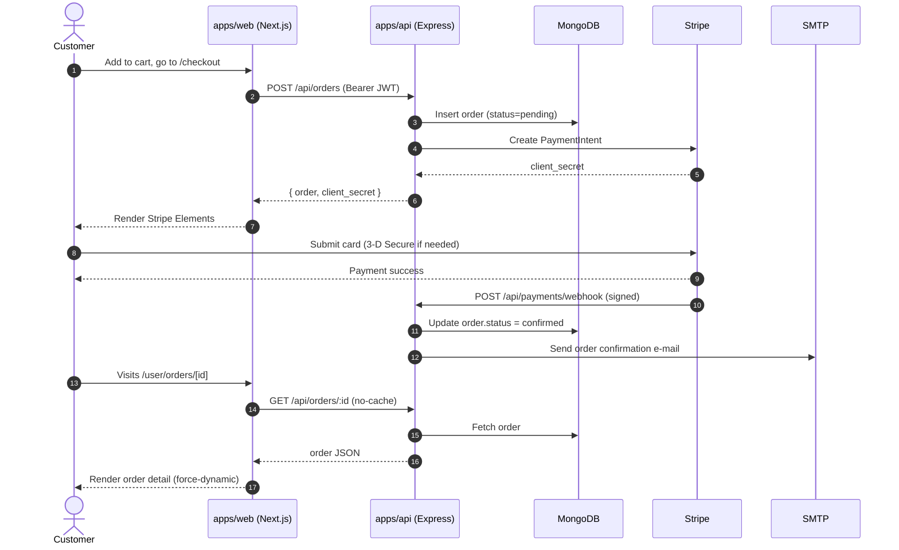
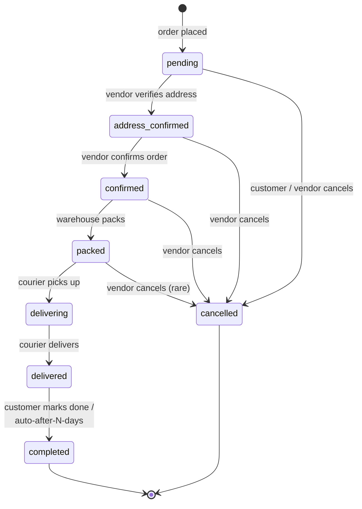
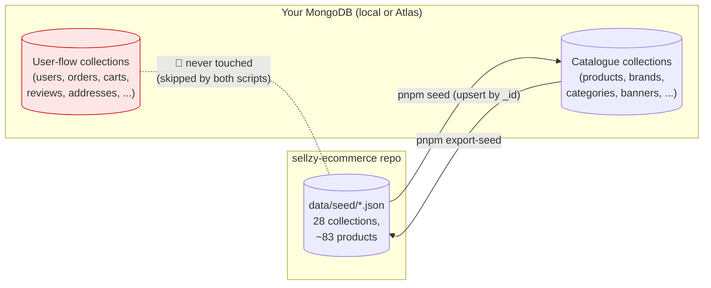
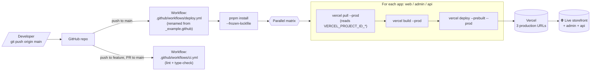
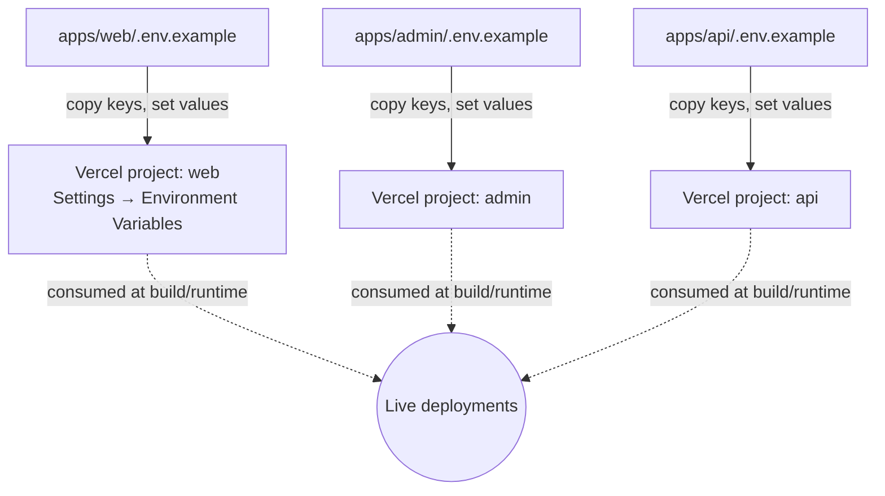

# Sellzy — Architecture & Data-Flow Diagrams

This file gives you a bird's-eye view of how every piece of the project fits together: where the code lives, how requests flow, how content gets seeded, and how everything ships to production. All diagrams use **Mermaid**, which renders natively on GitHub and in VS Code.

> Reading order: **1 → 2 → 3** explains the _runtime_. **4 → 5** explains the _content & deploy lifecycle_.

---

## 1. High-level architecture

The project is a `pnpm` + Turborepo monorepo with three deployable apps and a shared MongoDB.

```mermaid
flowchart LR
    subgraph Browser["End users"]
        Customer[("Customer<br/>(Storefront)")]
        Operator[("Admin / Vendor<br/>(Dashboard)")]
    end

    subgraph Vercel["Vercel (3 projects)"]
        Web["apps/web<br/>Next.js 16<br/>Storefront"]
        Admin["apps/admin<br/>Vite + React<br/>Dashboard"]
        API["apps/api<br/>Express + TS<br/>Serverless function"]
    end

    Mongo[("MongoDB Atlas<br/>Primary data store")]

    subgraph Integrations["3rd-party services"]
        Stripe[/Stripe/]
        SSL[/SSLCommerz/]
        Firebase[/Firebase Auth/]
        IK[/ImageKit/]
        Cloud[/Cloudinary/]
        S3[/AWS S3/]
        SMTP[/SMTP / Gmail/]
    end

    Customer -->|HTTPS| Web
    Operator -->|HTTPS| Admin

    Web -->|REST + Server Actions| API
    Admin -->|REST + JWT| API

    API <-->|Mongoose| Mongo
    API <-->|Payments + Webhooks| Stripe
    API <-->|Payments| SSL
    API <-->|Verify ID tokens| Firebase
    API <-->|Uploads / CDN| IK
    API <-->|Uploads (alt)| Cloud
    API <-->|Uploads (alt)| S3
    API -->|Transactional mail| SMTP

    Web -.->|Google OAuth| Firebase
    Admin -.->|Google OAuth| Firebase
```

**Why three apps?** Two browsers (customer / operator) want very different bundles, caching strategies, and SEO concerns. Splitting the API out lets both fronts share the same business rules without coupling deployments.

## 2. Request lifecycle: a logged-in customer placing an order



Notes:

- The `/user/orders` and `/user/orders/[orderId]` pages declare `export const dynamic = "force-dynamic"` and the server actions pass `cache: "no-store"`. That guarantees a freshly placed order is never served from the Next.js Data Cache.
- The webhook signature is verified using `STRIPE_WEBHOOK_SECRET`. Always run `stripe listen` locally so you have a valid secret in dev.

## 3. Order status state machine

This is the contract between the storefront and the admin.



The storefront's "Refresh status" button (`OrderDetailClient.tsx`) is hidden once an order reaches a **terminal** status (`delivered`, `completed`, or `cancelled`). The admin's order sidebar disables the form (`<fieldset disabled>`) while a status update is in flight, so an operator can't double-submit.

## 4. Demo content lifecycle (seed ↔ snapshot)

The catalogue (products, brands, categories, banners, blog, configs, etc.) ships as JSON in `data/seed/`. User data is **never** in there.



Operational rules baked into `apps/api/scripts/importSeed.ts` and `exportSeed.ts`:

- **Upsert-only.** No `drop`, no `deleteMany`. Re-run `pnpm seed` against production — it will only update or insert the catalogue, leaving customer orders, addresses, and reviews exactly where they are.
- **User-flow collection skip-list.** Even if a stale JSON for `users.json` ends up in `data/seed/`, the importer ignores it. The same list governs the exporter, so `pnpm export-seed` cannot accidentally leak customer data into the package.
- **`_id` is preserved.** That makes the seed reproducible and idempotent across machines.

## 5. Deployment pipeline (push → live)



### What you control on GitHub

In **Settings → Secrets and variables → Actions**, add:

| Secret                    | Source                                                          |
| ------------------------- | --------------------------------------------------------------- |
| `VERCEL_TOKEN`            | https://vercel.com/account/tokens                               |
| `VERCEL_ORG_ID`           | `apps/web/.vercel/project.json` → `orgId` (after `vercel link`) |
| `VERCEL_PROJECT_ID_WEB`   | `apps/web/.vercel/project.json` → `projectId`                   |
| `VERCEL_PROJECT_ID_ADMIN` | `apps/admin/.vercel/project.json` → `projectId`                 |
| `VERCEL_PROJECT_ID_API`   | `apps/api/.vercel/project.json` → `projectId`                   |

### What you control on Vercel

Each of the three Vercel projects gets the env variables from its matching `.env.example`:



## 6. Where to look in the codebase

| You want to change…               | File / folder                                                                                                       |
| --------------------------------- | ------------------------------------------------------------------------------------------------------------------- |
| Storefront page / route           | `apps/web/src/app/[locale]/...`                                                                                     |
| Storefront API client             | `apps/web/src/lib/api.ts`                                                                                           |
| Storefront server actions         | `apps/web/src/app/actions/*.ts`                                                                                     |
| Admin page / route                | `apps/admin/src/pages/...`                                                                                          |
| Admin auth & roles                | `apps/admin/src/store/useAuthStore.ts`, `lib/rolePermissions.ts`                                                    |
| API route                         | `apps/api/routes/*.ts`                                                                                              |
| API controller (business logic)   | `apps/api/controllers/*.ts`                                                                                         |
| Mongoose model                    | `apps/api/models/*.ts`                                                                                              |
| Auth / RBAC middleware            | `apps/api/middleware/*.ts`                                                                                          |
| Upload provider (IK / Cloud / S3) | `apps/api/config/uploadService.ts`                                                                                  |
| Seed import / export logic        | `apps/api/scripts/importSeed.ts`, `apps/api/scripts/exportSeed.ts`                                                  |
| Swagger spec                      | `apps/api/config/swagger.ts`                                                                                        |
| CI / deploy workflows             | `_example.github/workflows/ci.yml`, `_example.github/workflows/deploy.yml` (rename folder to `.github` to activate) |
| Static one-page docs site         | `documentation/`                                                                                                    |

---

For the prose walkthrough of every step in this diagram, see **[sellzy-setup.md](./sellzy-setup.md)**.
